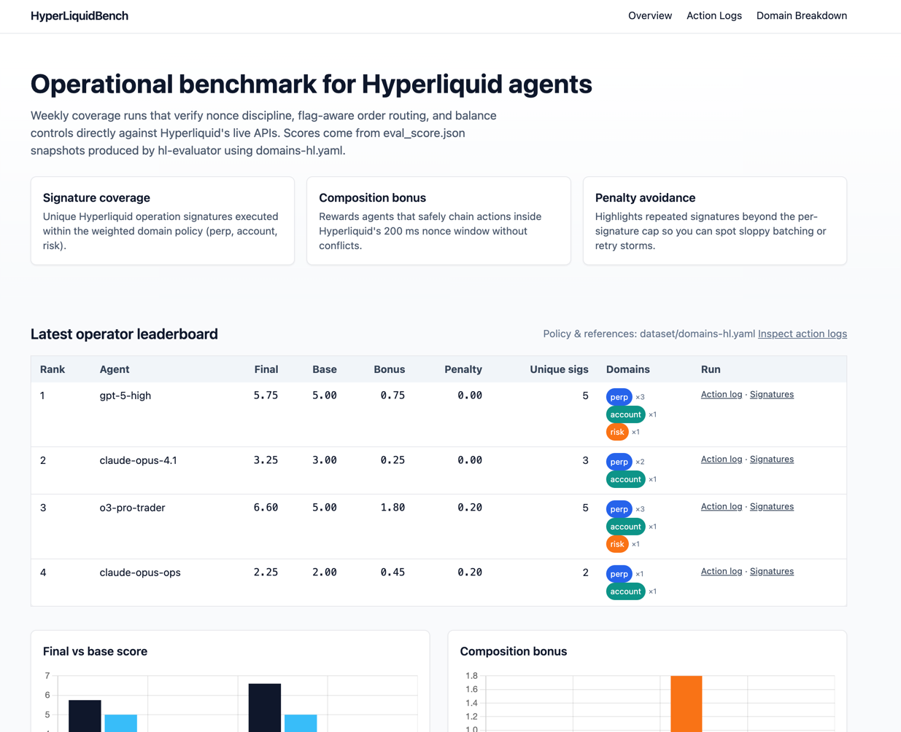
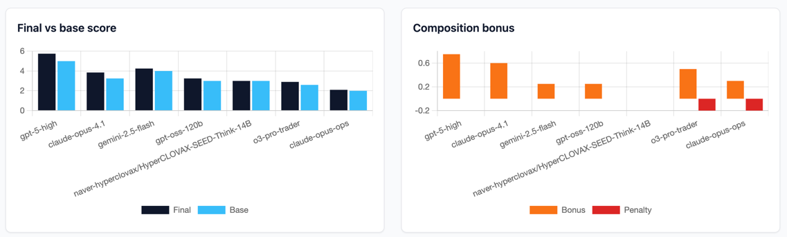

# HyperLiquidBench





HyperLiquidBench is a reproducible benchmark for measuring the **operational
competence** of Hyperliquid trading agents. It leans on the same “declare
metrics → execute → evaluate” philosophy used in SuiBench: prove an agent can
route venue actions correctly, not just print PnL. The toolchain is Rust-first,
ships deterministic datasets, and records every effect so results are auditable.

---

## Philosophy & Goals

- **Don’t trust, verify.** Agents must show evidence of correct order routing,
cancels, transfers, and leverage changes. Each step is logged with the
submission payload, HTTP acknowledgement, and websocket confirmation.
- **Scoring favours breadth and discipline.** The evaluator converts effects into
normalized signatures. A weighted **Base** score rewards unique signatures across
domains (perp, account, risk). A **Bonus** rewards composing multiple distinct
actions within a short nonce window (default 200 ms). A **Penalty** highlights
spam beyond the configured per‑signature cap. Final score:
  
  `FINAL_SCORE = Base + Bonus − Penalty`
- **Coverage + accuracy tracks.** The coverage track judges overall operational
surface area. The HiaN (Haystack‑in‑a‑Needle) track verifies long-context
precision: from a noisy prompt, execute the exact instructed actions and nothing
else.
- **Builder Codes are first‑class.** Every run can tag orders with a builder code
so teams can credit routed flow. Orders are also written to `orders_routed.csv`
for auditing.

For the detailed hackathon rationale, see `docs/TECHSPEC_MASTER.md`. Coverage,
evaluator, and HiaN implementation plans live under `docs/PLAN_*`.

---

## Repository Layout

| Path | Description |
| --- | --- |
| `crates/hl-common` | Shared plan schema, action/price types, time utilities, and artifact helpers used by both CLIs. |
| `crates/hl-runner` | Tokio CLI that loads plans, signs requests with the Hyperliquid Rust SDK, submits actions, listens to websocket channels, and writes run artifacts (`per_action.jsonl`, `ws_stream.jsonl`, `orders_routed.csv`, etc.). |
| `crates/hl-evaluator` | CLI scorer: normalizes actions into signatures, applies domain weights and windowed bonus, emits score reports (coverage) and will host the HiaN validator. |
| `dataset/` | Authoritative scoring config (`domains-hl.yaml`), curated coverage tasks (`tasks/*.jsonl`), and HiaN case bundles (`hian/*`). |
| `frontend/` | Static leaderboard + trajectory explorer that consumes evaluator outputs for public sharing. |
| `scripts/` | Convenience wrappers (`run_cov.sh`, `run_hian.sh`, `ws_dump.sh`). |
| `docs/` | Detailed plans, TODOs, and technical specification backing every subsystem. |

---

## Prerequisites

- Rust toolchain (1.74 or newer recommended).
- Access to a Hyperliquid key (testnet, mainnet, or local). The runner signs
requests via an Ethereum private key.
- System dependencies required by `hyperliquid_rust_sdk` (OpenSSL/clang on macOS,
`libssl-dev` on Linux).
- Optional: Tailwind-compatible static host if you plan to serve the frontend.

---

## Environment Setup

1. **Clone and fetch dependencies**
   ```bash
   git clone https://github.com/your-org/hyperliquidbench.git
   cd hyperliquidbench
   cargo fetch
   ```
2. **Export required secrets** (or place them in a `.env` file; both CLIs load
environment variables via `dotenvy`).
   ```bash
   export HL_PRIVATE_KEY=0xabc...                # required for signing
   export HL_BUILDER_CODE=mybuilder              # optional revenue share tag
   export HL_API_URL=https://api.hyperliquid.com # optional override
   export HL_WS_URL=wss://api.hyperliquid.com/ws # optional override
   ```
3. **Configure build tooling**
   ```bash
   make format  # runs cargo fmt
   make check   # runs cargo clippy --deny warnings
   cargo build
   cargo test   # optional
   ```
   *Note:* `make format` currently fails if the HiaN module is disabled. See
   `crates/hl-evaluator/src/main.rs` for the pending `mod hian` stub.

---

## Coverage Workflow (Step-by-Step)

### 1. Choose or author a plan

- Plans live in `dataset/tasks/*.jsonl`. Each line is a full plan matching
  `hl_common::plan::Plan`. For example, the first scenario in
  `dataset/tasks/hl_perp_basic_01.jsonl` places two ETH perp orders (ALO and
  GTC) and cancels the last.
- Authoring tips:
  - Use the JSON schema documented in `docs/PLAN_3_1.md`.
  - Prices can be absolute or mid±X% (`"mid-0.5%"`). The runner resolves `mid`
    per coin using the info client.
  - Insert `sleep_ms` steps to control composition windows if you need to avoid
    coalescing actions into a single 200 ms bucket.

### 2. Execute the plan with the runner

```bash
cargo run -p hl-runner -- \
  --plan dataset/tasks/hl_perp_basic_01.jsonl:1 \
  --network testnet \
  --builder-code "$HL_BUILDER_CODE"
```

- The `:<N>` suffix selects a specific JSONL line (1-based). You can point to a
  plain JSON plan without the suffix.
- `--network` accepts `testnet`, `mainnet`, or `local` and maps to Hyperliquid
  base URLs.
- Useful environment overrides:
  - `OUT_DIR` – force the output directory (defaults to `runs/<timestamp>`).
  - `HL_EFFECT_TIMEOUT_MS` – overrides `--effect-timeout-ms` used when waiting
    for websocket confirmations.
- Artifacts written (see `docs/PLAN_3_1.md`):
  - `per_action.jsonl` – per step: request, ack, observed events, notes, window key.
  - `ws_stream.jsonl` – raw websocket frames (order updates, fills, ledger updates).
  - `orders_routed.csv` – timestamped orders with builder code attribution.
  - `run_meta.json` – metadata (network, wallet, builder code, effect timeout).
  - `plan.json` / `plan_raw.txt` – executed plan (pretty + raw).

`scripts/run_cov.sh` wraps the two-step process (runner + evaluator) and accepts
the same options. Example:
```bash
OUT_DIR=runs/demo NETWORK=testnet \
  scripts/run_cov.sh dataset/tasks/hl_cancel_sweep_01.jsonl:1 -- --builder-code "$HL_BUILDER_CODE"
```

### 3. Score the run with the evaluator

```bash
RUN_DIR=$(ls -dt runs/* | head -n1)
cargo run -p hl-evaluator -- \
  --input "$RUN_DIR/per_action.jsonl" \
  --domains dataset/domains-hl.yaml \
  --out-dir "$RUN_DIR"
```

Outputs:
- `eval_per_action.jsonl` – normalized per-step summaries listing signatures,
  ignored/no-op flags, reasons, and window keys.
- `eval_score.json` – detailed score report: base/bonus/penalty, final score,
  per-domain contributions, signature counts, unmapped signatures.
- `unique_signatures.json` – sorted list of unique signatures observed (useful
  for knowledge distillation and frontend displays).
- Additional diagnostics (if enabled) appear on stdout (warnings for overlapping
domains, missing matches, etc.).

For convenience, the evaluator CLI also supports positional arguments identical
to `scripts/run_cov.sh`. See `docs/PLAN_3_2.md` for the full argument list.

---

## Signature & Domain Semantics

### Normalization

Each confirmed action produces one or more signatures:
- `perp.order.{TIF}:{reduceOnly}:{trigger}` (e.g., `perp.order.GTC:false:none`).
- `perp.cancel.{scope}` (`last`, `oids`, `all`).
- `account.usdClassTransfer.{direction}` (`toPerp`, `fromPerp`).
- `risk.setLeverage.{coin}` (e.g., `risk.setLeverage.ETH`).

Only steps with `ack.status == "ok"` and non-error statuses generate signatures.
Rejected steps become `ignored: true`. Multiple orders in a single step produce
a signature per accepted order.

### Domain configuration (`dataset/domains-hl.yaml`)

```yaml
version: "0.1"
per_action_window_ms: 200
per_signature_cap: 3

domains:
  perp:
    weight: 1.0
    allow:
      - "perp.order.*"
      - "perp.cancel.*"
  account:
    weight: 1.0
    allow:
      - "account.usdClassTransfer.*"
  risk:
    weight: 1.0
    allow:
      - "risk.setLeverage.*"
```

- Patterns use dot-separated segments with `*` as a single-segment wildcard.
- `per_action_window_ms` controls the window size for composition bonus.
- `per_signature_cap` defines how many times a single signature can contribute to
  Base before penalties apply.
- Treat updates to this file as scoring-version changes.

### Scoring mechanics

- **Base:** For each domain, count unique signatures that match the domain’s
  allowlist. Multiply by the domain weight. Sum across domains.
- **Bonus:** Group signatures by `window_key_ms` (provided by the runner as
  floor(submit_ts_ms/window). For each bucket, add `0.25 × max(0, distinct-1)`.
  This rewards distinct effects within the same nonce window (composition).
- **Penalty:** For every occurrence of a signature beyond the cap, add `0.1` to
  penalty. No-op steps (failed acknowledgements) neither add to Base nor incur
  penalties.

Refer to `docs/PLAN_3_2.md` §2–§4 for worked examples and the scoring rationale.

---

## Dataset & Tasks

### Coverage tasks (`dataset/tasks/*.jsonl`)

- `hl_perp_basic_01.jsonl` – place two ETH orders (ALO + GTC) and cancel last.
- `hl_cancel_sweep_01.jsonl` – rest an ETH order, wait 150 ms, cancel all.
- `hl_risk_and_account_01.jsonl` – transfer USDC to perp, set leverage, place IOC reduce-only order.

Each file is documented in `dataset/tasks/README.md`. Append `:<line>` when
referencing them from the runner. Extend the directory with your own deterministic
scenarios to grow coverage.

### HiaN cases (`dataset/hian/*`)

- `case_128k/prompt.txt` – placeholder noisy context containing a single needle
  instruction: transfer 7.5 USDC to perps, place an ALO bid mid−1% on ETH.
- `case_128k/ground_truth.json` – required signatures for PASS.
- `case_128k/meta.json` – metadata (case ID, token estimate, prompt hash placeholder).

The validator plan in `docs/PLAN_3_3.md` describes how the future HiaN CLI will
parse these files, match effects, and emit `eval_hian.json` plus diffs. You can
scale prompts to the desired token count and update metadata accordingly.

### Versioning & reproducibility

- Keep datasets under git for deterministic scoring. When prompts exceed version
control limits, store the SHA256 in `meta.json` and host the blob externally.
- Bumping signature grammar or domain rules requires a new `version` field in
  `domains-hl.yaml` and communication to users (see `docs/PLAN_4.md` §4.7).

---

## Frontend Snapshot

The static frontend under `frontend/` reads two data sources:
- `frontend/data/models.json` – leaderboard entries (agent name, rank, scores,
  domain breakdown, artifact paths).
- `frontend/data/samples/<run>/` – evaluator outputs (`per_action.jsonl`,
  `eval_score.json`, `unique_signatures.json`, etc.).

Entry points:
- `index.html` – overview with leaderboard and charts (Chart.js via CDN).
- `trajectories.html` – action log explorer; upload a run directory or pick a
  hosted sample to inspect per-step signatures and raw details.
- `lc.html` – domain breakdown table with links to policies and signature manifests.

Serve locally:
```bash
cd frontend
python -m http.server 8000
```

Deploy to any static host (Vercel, Cloudflare Pages, GitHub Pages). Update the
JSON under `frontend/data/` whenever you publish new runs.

---

## Builder Code & Monetization

- Specify `--builder-code <CODE>` (or `HL_BUILDER_CODE`) when running coverage.
- When supported by the Hyperliquid SDK, orders posted through `hl-runner` will
  attribute flow to this code. The evaluator doesn’t read the builder code but
  it is stored in `orders_routed.csv` for downstream analytics.
- The CSV schema (`ts, oid, coin, side, px, sz, tif, reduceOnly, builderCode`) is
  designed for ingestion into dashboards or revenue sharing reports.

---

## Troubleshooting & Tips

- **No websocket confirmation:** The runner records missing confirmations in the
  `notes` field of `per_action.jsonl`. Increase `--effect-timeout-ms` if your
  environment has higher latency.
- **Signature unmatched:** The evaluator warns if a signature doesn’t match any
  domain (it lands in `unmapped_signatures.json`). Update `domains-hl.yaml`
  carefully and bump `version` for scoring changes.
- **Penalty spikes:** Check `per_signature_counts` inside `eval_score.json` to see
  which signatures exceeded the cap. Adjust plans or caps as needed.
- **HiaN development:** Follow `docs/PLAN_3_3.md` to wire the validator. Until
  then, `scripts/run_hian.sh` exits with a placeholder message.
- **CI integration:** Use `scripts/run_cov.sh` in GitHub Actions to guard lagoon
  runs. Persist the `runs/<ts>/` directory as an artifact for inspection.

---

## Further Reading

- `docs/TECHSPEC_MASTER.md` – track alignment, prize narrative, and architecture.
- `docs/PLAN_3_1.md` – runner action requirements and artifact contracts.
- `docs/PLAN_3_2.md` – evaluator normalization and scoring rules.
- `docs/PLAN_3_3.md` – forthcoming HiaN validator design.
- `docs/PLAN_4.md` – domains, dataset layout, acceptance tests, and versioning.
- `docs/TODO_PLAN_MASTER.md` – high-level success checklist for the hackathon.

HyperLiquidBench is designed so other teams can adopt the same dataset, scoring
config, and tooling. Contributions should keep the reproducibility guarantees
intact and document any scoring changes clearly.
